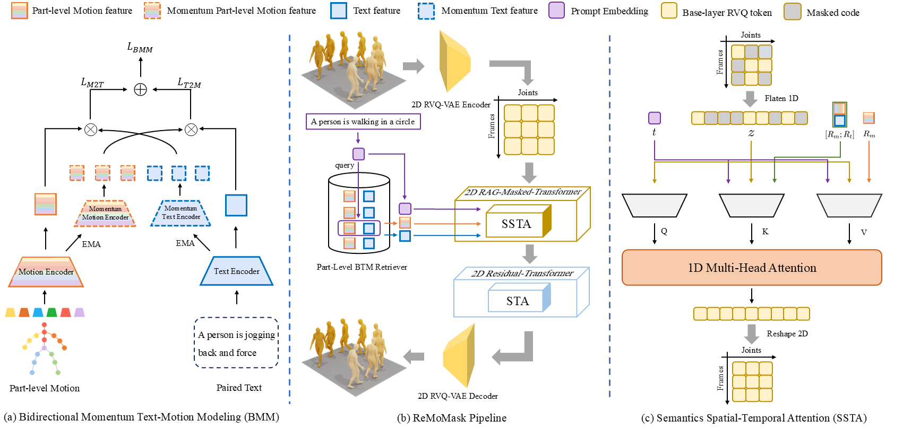

# ReMoMask: Retrieval-Augmented Masked Motion Generation<br>

This is the official repository for the paper:
> **ReMoMask: Retrieval-Augmented Masked Motion Generation**
>
> Zhengdao Li\*, Siheng Wang\*, [Zeyu Zhang](https://steve-zeyu-zhang.github.io/)\*<sup>†</sup>, and [Hao Tang](https://ha0tang.github.io/)<sup>#</sup>
>
> \*Equal contribution. <sup>†</sup>Project lead. <sup>#</sup>Corresponding author.
>
> ### [Paper]() | [HF Paper]()

# ✏️ Citation

---

# 👋 Introduction

Text-to-Motion (T2M) generation aims to synthesize realistic and semantically aligned human motion sequences from natural language descriptions. However, current approaches face dual challenges: Generative models (e.g., diffusion models) suffer from limited diversity, error accumulation, and physical implausibility, while Retrieval-Augmented Generation (RAG) methods exhibit diffusion inertia, partial-mode collapse, and asynchronous artifacts. To address these limitations, we propose **ReMoMask**, a unified framework integrating three key innovations: 1) A **Bidirectional Momentum Text-Motion Model** decouples negative sample scale from batch size via momentum queues, substantially improving cross-modal retrieval precision; 2) A **Semantic Spatiotemporal Attention mechanism** enforces biomechanical constraints during part-level fusion to eliminate asynchronous artifacts; 3) **RAG-Classier-Free Guidance** incorporates minor unconditional generation to enhance generalization. Built upon MoMask's RVQ-VAE, ReMoMask efficiently generates temporally coherent motions in minimal steps. Extensive experiments on standard benchmarks, including HumanML3D, demonstrate state-of-the-art performance, with the FID score significantly improved to **0.095** compared to SOTA RAG-t2m method.




# 🤗 Prerequisite
<details> 

## Environment
```bash
conda create -n remomask python=3.10
pip install torch==2.1.0 torchvision==0.16.0 torchaudio==2.1.0 --index-url https://download.pytorch.org/whl/cu118
pip install -r requirements.txt
conda activate remomask
```
we trained our RAG model on A800, and t2m model on H20.

## Dependencies
### 1. Download the pretrained models
- `RAG`: Download the [pretrained-rag-models]() (comming soon) and place at `./Part_TMR`

- `T2M`: Download the [pretrained-t2m-models]() (comming soon) and place at `./logs/humanml3d/`


### 2. Evaluation Models and Gloves
Follow previous [method](https://github.com/EricGuo5513/momask-codes?tab=readme-ov-file#2-models-and-dependencies) to prepare the evaluation models and gloves. Or you can download from [here](https://virutalbuy-public.oss-cn-hangzhou.aliyuncs.com/share/mogents/checkpoints.zip) (provided by [MoGenTS](https://github.com/weihaosky/mogents)) and place to `./checkpoints`

### 3. Prepare training dataset 
Follow the instruction in [HumanML3D](https://github.com/EricGuo5513/HumanML3D.git), then place the result dataset to `./dataset/HumanML3D`.
</details>

# 🚀 Demo
<details> 

```bash
python demo.py --gpu_id 0 --ext exp1 --text_prompt "A person is walking on a circle." --checkpoints_dir logs --dataset_name humanml3d --mtrans_name pretrain_mtrans --rtrans_name pretrain_rtrans
# change pretrain_mtrans and pretrain_rtrans to your mtrans and rtrans after your training done
```
explanation:
* `--repeat_times`: number of replications for generation, default `1`.
* `--motion_length`: specify the number of poses for generation.

output will be in `./outputs/exp1/`
</details> 


# 🛠️ Train your own models
<details>

## stage1: train a Part-Level BMM Retriever
```bash
python -m Part_TMR.scripts.train
```
then build a rag database for training t2m model:
```bash
python build_rag_database.py
```
you will get `./database`


## stage2: train a Retrieval augemented MoMask
### tarin a 2D RVQ-VAE quantizer
```bash
bash run_rvq.sh vq 0 humanml3d --batch_size 256 --num_quantizers 6 --max_epoch 50 --quantize_dropout_prob 0.2 --gamma 0.1 --code_dim2d 1024 --nb_code2d 256
```

### train a 2D retrieval-augmented masked transformer
```bash
# using one gpu
bash run_mtrans.sh mtrans 1 0 humanml3d --vq_name pretrain_vq --batch_size 256 --max_epoch 2000 --attnj --attnt --latent_dim 512 --n_heads 8
# using multi gpus
bash run_mtrans.sh mtrans 8 0,1,2,3,4,5,6,7 humanml3d --vq_name pretrain_vq --batch_size 256 --max_epoch 2000 --attnj --attnt --latent_dim 512 --n_heads 8
```

### tarin a 2D residual transformer
```bash
# using multi gpus 
bash run_rtrans.sh rtrans 2 humanml3d --batch_size 64 --vq_name vq --cond_drop_prob 0.01 --share_weight --max_epoch 2000 --attnj --attnt
# here, 2 means cuda:0,1
```
</details>


# 💪 Evalution
<details>

## Evaluate the RAG  
```bash 
python -m Part_TMR.scripts.test
```


## Evaluate the T2M

### 1. Evaluate the 2D RVQ-VAE
```bash
python eval_vq.py --gpu_id 0 --name pretrain_vq --dataset_name humanml3d --ext eval --which_epoch net_best_fid.tar
# change pretrain_vq to your vq
```

### 2. Evaluate the 2D retrieval-augmented masked transformer
```bash
python eval_mask.py --dataset_name humanml3d --mtrans_name pretrain_mtrans --gpu_id 0 --cond_scale 4 --time_steps 10 --ext eval --which_epoch fid
# change pretrain_mtrans to your mtrabs
```


### 3. Evaluate the 2D RAG masked transformer & 2D Residual Transformer
HumanML3D:
```bash
python eval_res.py --gpu_id 0 --dataset_name humanml3d --mtrans_name pretrain_mtrans --rtrans_name pretrain_rtrans --cond_scale 4 --time_steps 10 --ext eval --which_ckpt net_best_fid.tar --which_epoch fid --traverse_res
# change pretrain_mtrans and pretrain_rtrans to your mtrans and rtrans
```

KIT-ML:
```bash
python eval_res.py --gpu_id 0 --dataset_name kit --mtrans_name pretrain_mtrans_kit --rtrans_name pretrain_rtrans_kit --cond_scale 4 --time_steps 10 --ext eval --which_ckpt net_best_fid.tar --which_epoch fid --traverse_res
# change pretrain_mtrans and pretrain_rtrans to your mtrans and rtrans
```
</details>


# 🤖 Visualization
<details>

## 1. download and set up blender
<details>

You can download the blender from [instructions](https://www.blender.org/download/lts/2-93/). Please install exactly this version. For our paper, we use `blender-2.93.18-linux-x64`. 
> 
### a. unzip it:
```bash
tar -xvf blender-2.93.18-linux-x64.tar.xz
```

### b. check if you have installed the blender successfully or not:
```bash
cd blender-2.93.18-linux-x64
./blender --background --version
```
you should see: `Blender 2.93.18 (hash cb886axxxx built 2023-05-22 23:33:27)`
```bash
./blender --background --python-expr "import sys; import os; print('\nThe version of python is ' + sys.version.split(' ')[0])"
```
you should see: `The version of python is 3.9.2`

### c. get the blender-python path
```bash
./blender --background --python-expr "import sys; import os; print('\nThe path to the installation of python is\n' + sys.executable)"
```
you should see: `	The path to the installation of python is /xxx/blender-2.93.18-linux-x64/2.93/python/bin/python3.9s`

### d. install pip for blender-python
```bash
/xxx/blender-2.93.18-linux-x64/2.93/python/bin/python3.9 -m ensurepip --upgrade
/xxx/blender-2.93.18-linux-x64/2.93/python/bin/python3.9 -m pip install --upgrade pip
```

### e. prepare env for blender-python
```bash 
/xxx/blender-2.93.18-linux-x64/2.93/python/bin/python3.9 -m pip install numpy==2.0.2
/xxx/blender-2.93.18-linux-x64/2.93/python/bin/python3.9 -m pip install matplotlib==3.9.4
/xxx/blender-2.93.18-linux-x64/2.93/python/bin/python3.9 -m pip install hydra-core==1.3.2
/xxx/blender-2.93.18-linux-x64/2.93/python/bin/python3.9 -m pip install hydra_colorlog==1.2.0
/xxx/blender-2.93.18-linux-x64/2.93/python/bin/python3.9 -m pip install moviepy==1.0.3
/xxx/blender-2.93.18-linux-x64/2.93/python/bin/python3.9 -m pip install shortuuid==1.0.13
/xxx/blender-2.93.18-linux-x64/2.93/python/bin/python3.9 -m pip install natsort==8.4.0
/xxx/blender-2.93.18-linux-x64/2.93/python/bin/python3.9 -m pip install pytest-shutil==1.8.1
/xxx/blender-2.93.18-linux-x64/2.93/python/bin/python3.9 -m pip install tqdm==4.67.1
/xxx/blender-2.93.18-linux-x64/2.93/python/bin/python3.9 -m pip install tqdm==1.17.0
```
</details>


## 2. calulate SMPL mesh:
```bash
python -m fit --dir new_test_npy --save_folder new_temp_npy --cuda cuda:0
```

## 3. render to video or sequence
```bash
/xxx/blender-2.93.18-linux-x64/blender --background --python render.py -- --cfg=./configs/render_mld.yaml --dir=test_npy --mode=video --joint_type=HumanML3D
```
- `--mode=video`: render to mp4 video
- `--mode=sequence`: render to a png image, calle sequence.

</details>

# 👍 Acknowlegements
We sincerely thank the open-sourcing of these works where our code is based on:

[MoMask](https://github.com/EricGuo5513/momask-codes),
[MoGenTS](https://github.com/weihaosky/mogents),
[ReMoDiffuse](https://github.com/mingyuan-zhang/ReMoDiffuse),
[MDM](https://github.com/GuyTevet/motion-diffusion-model),
[TMR](https://github.com/Mathux/TMR),
[ReMoGPT](https://ojs.aaai.org/index.php/AAAI/article/view/33044)

## 🔒 License
This code is distributed under an [MIT LICENSE](LICENSE).

Note that our code depends on other libraries, including CLIP, SMPL, SMPL-X, PyTorch3D, and uses datasets that each have their own respective licenses that must also be followed.
